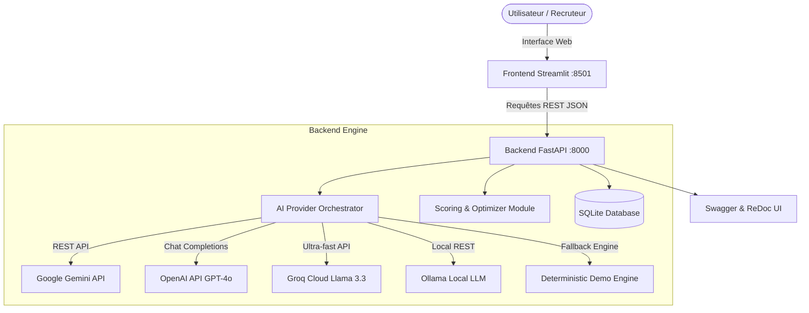

# ⚡ Enterprise AI Prompt Studio & Optimizer

[](https://www.python.org/)
[](https://fastapi.tiangolo.com)
[](https://streamlit.io)
[](https://docs.pydantic.dev/)
[](https://docs.pytest.org/)
[](https://www.docker.com/)
[](https://opensource.org/licenses/MIT)

Une plateforme fullstack de niveau production conçue pour l'**ingénierie de prompts avancée**, l'**orchestration de LLMs multi-fournisseurs** (Google Gemini, OpenAI, Groq, Ollama), l'**audit sémantique automatisé** et le **test en direct dans un bac à sable (sandbox)**.

---

## 🎯 Ce que ce projet démontre sur un CV / Portfolio

| Domaine Technique | Compétences & Technologies Implémentées |
| :--- | :--- |
| **Backend & API Architecture** | FastAPI, Python 3, Pydantic v2 (validation & DTOs), architecture modulaire, CORS, gestionnaire de cycle de vie (Lifespan). |
| **Génie Logiciel & IA Générative** | Orchestration multi-LLM (Google Gemini REST, OpenAI GPT-4o, Groq Llama 3.3, Ollama), métaprompting, frameworks RTF, CRISPE, Few-Shot, CoT. |
| **Prompt Optimization & Scoring** | Algorithmes d'évaluation multicritères (Structure, Longueur, Spécificité) combinés à un audit sémantique profond par LLM. |
| **Frontend & UX** | Streamlit, interface glassmorphism réactive par onglets, visualisations analytiques, copie 1-clic, exports JSON & Markdown. |
| **Base de Données & Persistance** | SQLite avec context managers sécurisés, requêtes préparées, migrations de schéma automatiques et recherche plein texte. |
| **DevOps & Qualité du Code** | Pytest (tests d'intégration et unitaires), Dockerfile multi-stage, Docker Compose, CI/CD GitHub Actions. |

---

## 🏗️ Architecture Globale du Système



---

## ✨ Fonctionnalités Majeures

### 1. 🚀 Studio de Génération par IA (Multi-Frameworks)
- **Génération réelle par LLM** : Fini les templates statiques ! Le système pilote un modèle d'IA via des métaprompts industriels pour concevoir des prompts sur mesure.
- **5 Méthodologies de Prompt Engineering au choix** :
  - **RTF** (*Role, Task, Format*)
  - **CRISPE** (*Capacity, Role, Insight, Statement, Personality, Experiment*)
  - **Few-Shot** (Génération d'exemples d'entrée/sortie précis)
  - **Chain-of-Thought (CoT)** (Décomposition du raisonnement logique)
  - **System Directive** (Directives de production avec balises XML strictes)
- **Modèle Cible Adaptable** : ChatGPT (OpenAI), Claude (Anthropic), Google Gemini, Llama 3 / Mistral.
- **Suivi des métriques** : Temps d'exécution (latence en secondes) et volume estimé de tokens.

### 2. ⚡ Optimiseur & Audit Sémantique
- Analysez n'importe quel prompt brut.
- L'agent d'audit IA identifie les faiblesses (manque de contexte, absence de contraintes négatives, formatage vague) et génère une version entièrement réécrite.
- Visualisez la progression de score en direct (**avant / après**).

### 3. 🧪 Bac à Sable en Direct (Live Sandbox)
- Testez directement votre prompt généré avec un cas d'usage réel sans quitter l'interface.
- Observez la réponse produite par le modèle sélectionné, son respect des consignes et son temps de réponse.

### 4. 📚 Gestion de Bibliothèque & Analytics
- Recherche plein texte instantanée dans les prompts sauvegardés.
- Filtrage par catégorie, tags et framework.
- Exportation en 1 clic : **JSON structuré**, **Markdown riche**, ou fichier individuel.
- Tableaux de bord de métriques de la bibliothèque (distribution des scores, frameworks les plus utilisés).

---

## 🚀 Démarrage Rapide

### Prérequis
- Python 3.10 ou supérieur
- Git

### 1. Cloner et préparer l'environnement
```bash
# Cloner le dépôt
git clone https://github.com/Assaadbenz/Generateur_Prompts_Text.git
cd Generateur_Prompts_Text

# Créer un environnement virtuel
python -m venv venv

# Activer l'environnement
# Sur Windows :
.\venv\Scripts\activate
# Sur Linux / macOS :
source venv/bin/activate

# Installer les dépendances
pip install -r requirements.txt
```

### 2. Configuration des Clés API (`.env`)
Copiez le modèle de configuration :
```bash
cp .env.example .env
```
Éditez le fichier `.env` pour ajouter votre clé selon vos préférences :
```dotenv
# Par défaut en mode 'mock', aucune clé n'est obligatoire (parfait pour tester instantanément !)
DEFAULT_AI_PROVIDER=mock

# Pour utiliser Google Gemini (Clé gratuite sur https://aistudio.google.com) :
GEMINI_API_KEY=votre_cle_gemini

# Ou OpenAI :
OPENAI_API_KEY=votre_cle_openai

# Ou Groq (Clé gratuite ultra-rapide sur https://console.groq.com) :
GROQ_API_KEY=votre_cle_groq
```

---

## 💻 Exécution

### Option 1 : Démarrage en 1 commande (Recommandé)
Lance automatiquement le Backend FastAPI et le Frontend Streamlit en parallèle :
```bash
python run.py
```

### Option 2 : Démarrage avec Docker Compose
```bash
docker-compose up --build
```

### Option 3 : Démarrage manuel (deux terminaux)
**Terminal 1 (Backend API) :**
```bash
python -m uvicorn backend.main:app --reload --host 0.0.0.0 --port 8000
```
**Terminal 2 (Frontend Streamlit) :**
```bash
streamlit run frontend/app.py
```

Accédez aux interfaces :
- **Application Web (Streamlit)** : [http://localhost:8501](http://localhost:8501)
- **Documentation API Interactive (Swagger)** : [http://localhost:8000/docs](http://localhost:8000/docs)
- **Documentation ReDoc** : [http://localhost:8000/redoc](http://localhost:8000/redoc)

---

## 🧪 Tests Automatisés

Le projet comprend une suite complète de tests unitaires et d'intégration couvrant l'API, les modèles LLM, l'optimiseur et la base de données SQLite :

```bash
python run_tests.py
```
ou directement avec pytest :
```bash
pytest tests/ -v
```

---

## 📁 Structure du Projet

```
Generateur_Prompts_Text/
├── .github/
│   └── workflows/
│       └── ci.yml               # Pipeline CI/CD GitHub Actions
├── backend/
│   ├── __init__.py
│   ├── config.py                # Configuration centralisée & variables d'environnement
│   ├── logger.py                # Système de logging rotatif
│   ├── ai_service.py            # Orchestrateur LLM (Gemini, OpenAI, Groq, Ollama, Mock)
│   ├── optimizer.py             # Algorithme d'évaluation multicritères (Structure, Longueur, Spécificité)
│   ├── gemini_service.py        # Service d'intégration de l'API Google Gemini
│   ├── database.py              # Couche d'accès aux données SQLite & analytics
│   └── main.py                  # API RESTful FastAPI (routes, validation, middlewares)
├── frontend/
│   └── app.py                   # Interface Streamlit (Génération IA, Optimisation, Historique & Thèmes)
├── tests/
│   ├── test_api.py              # Tests d'intégration FastAPI & endpoints
│   └── test_optimizer.py        # Tests unitaires de l'algorithme de scoring
├── .env.example                 # Modèle de variables d'environnement
├── Dockerfile                   # Image Docker multi-stage
├── docker-compose.yml           # Déploiement multi-services
├── requirements.txt             # Dépendances Python verrouillées
├── run.py                       # Script de lancement tout-en-un
├── run_tests.py                 # Runner de tests Pytest
├── IMPROVEMENTS.md              # Détail des évolutions d'ingénierie
└── README.md                    # Documentation officielle
```

---

## 📄 Licence
Ce projet est distribué sous licence MIT. Libre d'utilisation et d'adaptation.
